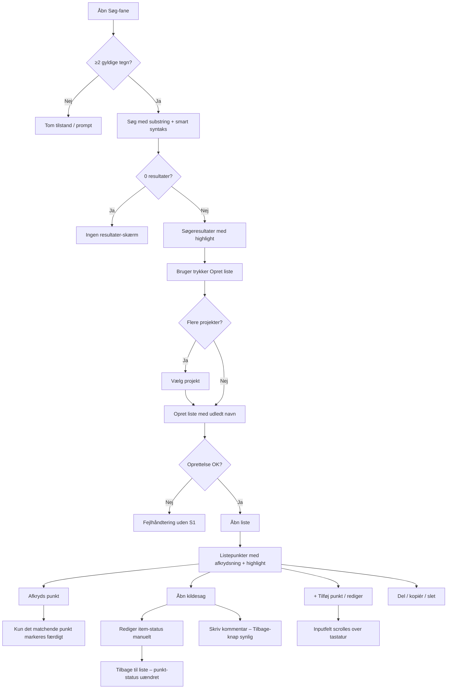
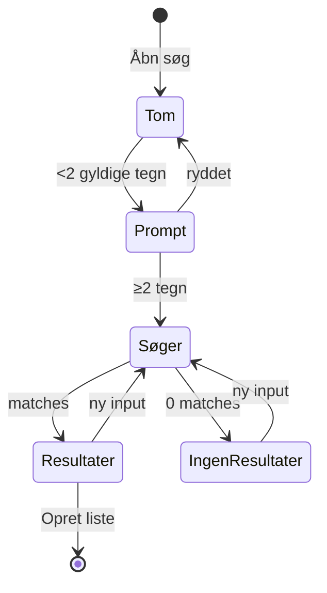
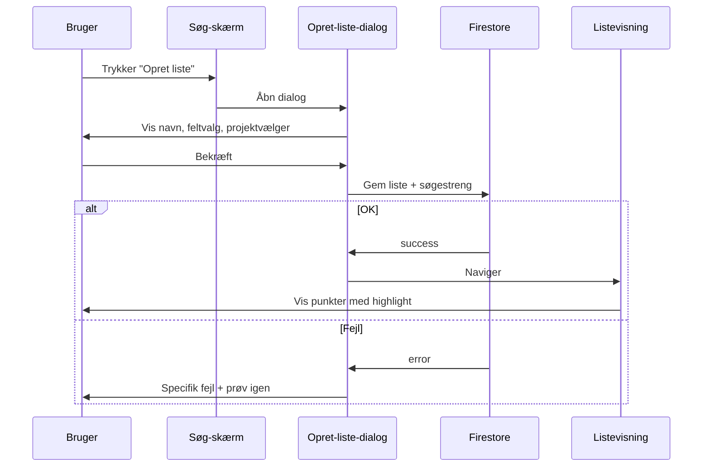
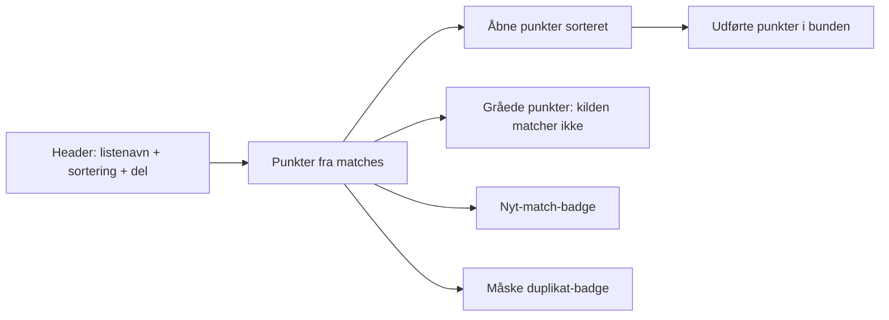
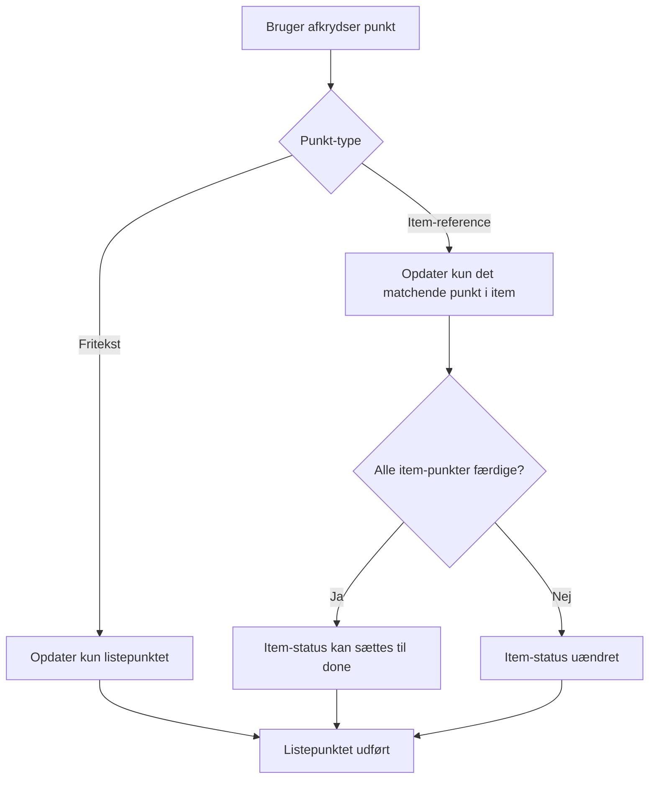
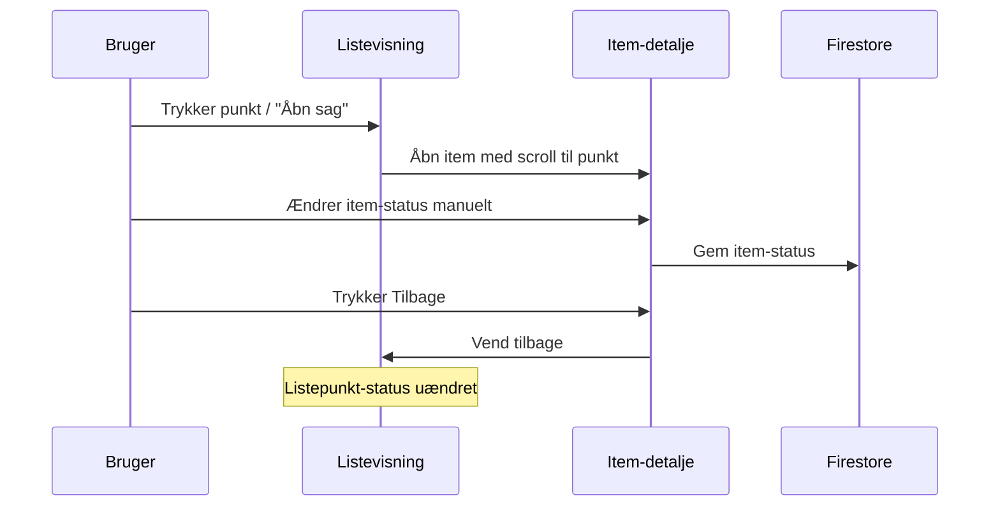
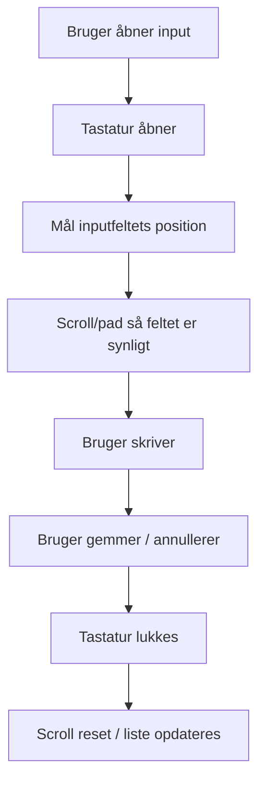
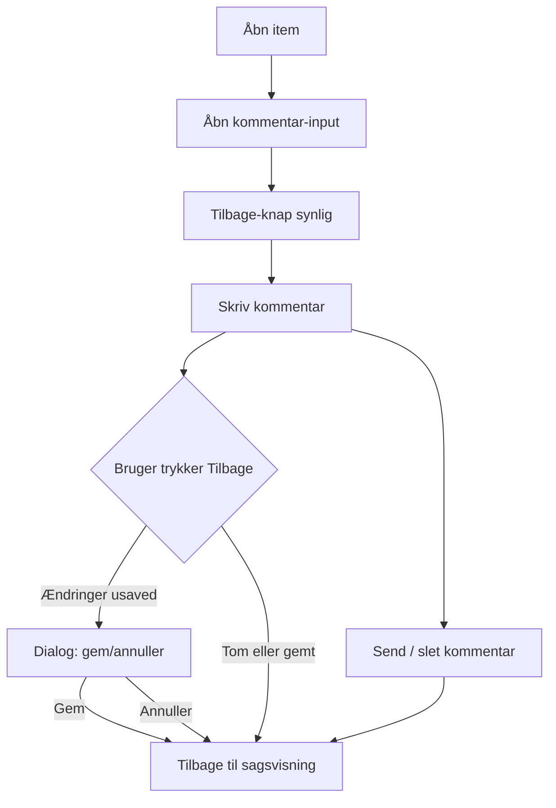
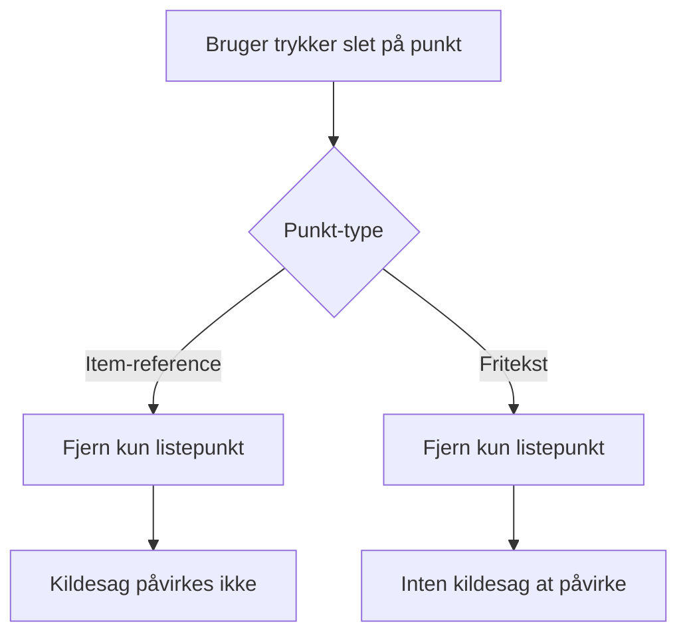

# Flow-design: Søgning og dynamiske lister (v2)

**Status:** Klar til Solution Design.  
**Primær agent:** Flowagent.  
**Input:** `us-002-search-v2.md`, `us-005-dynamic-lists-v2.md`, `us-005-context-lists-v2.md`, `team-status.md` afsnit 9.1–9.5, `plan-search-lists-redesign.md` fase 2.  
**Output til:** Solution Design Agent (Task #83).

---

## 0. Overordnet flow

---

## 1. Søgning

### 1.1 Skærm: Søg-fane

| # | Aktion | Systemreaktion | Edge case / fejl |
|---|---|---|---|
| 1.1 | Bruger åbner "Søg"-fane. | Søgefelt vises øverst med placeholder **"Søg i sager…"**.   Clear-knap (X) er skjult indtil der er input.   Ikon til syntakshjælp vises ved siden af feltet.   Tilstand er tom: vis enten alle sager eller prompt **"Start din søgning"** — afhænger af PO-valg (se US-002 åbne spørgsmål). | Hvis netværk offline: vis offline-tilstand. |
| 1.2 | Bruger trykker i søgefeltet. | Tastatur åbnes.   Cursor placeres i feltet.   Syntakshjælp-ikon forblives synlig. | — |
| 1.3 | Bruger indtaster 0 eller 1 gyldigt bogstav. | Søgning **udføres ikke**.   Der vises prompt: **"Skriv mindst 2 tegn for at søge."**   Tom listevisning; ingen loading. | Ét tal eller ét specialtegn tæller **ikke** som et gyldigt bogstav (S8). F.eks. input `&` alene viser prompten. |
| 1.4 | Bruger indtaster ≥2 gyldige tegn. | Debounce (300 ms).   Søgning udføres: substring/fuzzy i titel, beskrivelse og noter.   Antal resultater vises under søgefeltet. | Hvis input kun består af specialtegn/tal uden mindst 2 bogstaver: prompten vises stadig. |
| 1.5 | Bruger indtaster `Jem & Fix`. | Søgestrengen sendes råt til parseren.   Specialtegn `&` behandles som en del af token, **ikke** som AND-operator (S2).   Resultater indeholder sager med teksten "Jem & Fix". | `&`, `/`, `-`, tal, æøå bevares og afgrænser ikke søgningen forkert. |
| 1.6 | Søgeresultater returneres. | Hvert resultat viser:   - Item-titel   - Beskrivelse / note-udsnit   - Matchende ord/sætninger fremhæves med highlight (W1).   For `Jem & Fix` fremhæves "Jem", "&" og "Fix" hver for sig.   For `"vand i kælderen"` fremhæves hele den præcise sætning. | Hvis resultatet matcher i OCR-tekst (hvis scope): marker kildefeltet. |
| 1.7 | Bruger åbner syntakshjælp. | Modal/accordion åbner med tabel:   `vand` → finder "vandkande"   `*vand*` → kun hele ord   `"vand i kælderen"` → præcis frase   `vand -kælder` → uden "kælder"   `vand OR varme` → enten/eller   `projekt:Renovering` → filter   `Jem & Fix` → specialtegn bevares | Hjælp kan lukkes med tilbage-knap eller swipe-down. |
| 1.8 | Søgning giver 0 resultater. | Skærmen viser **"Ingen resultater for 'Jem & Fix'"**.   Knappen **"Opret liste"** er **deaktiveret** eller skjult (listen kræver resultater).   Bruger kan rydde søgning eller justere input. | Hvis 0 pga. specialtegn-parserfejl: logges ikke brugervendt; S2 skal forhindre dette. |

### 1.2 State-diagram for søgefelt

---

## 2. Opret dynamisk liste fra søgning

### 2.1 Skærm: Søgeresultater → Opret liste

| # | Aktion | Systemreaktion | Edge case / fejl |
|---|---|---|---|
| 2.1 | Bruger trykker **"Opret liste"** fra søgeresultater. | Dialog vises med:   - Forudfyldt listenavn (udledt fra søgestreng).   - Valg af felter der bliver til punkter (titel, beskrivelse/noter, kategori).   - Hvis flere projekter: projekt-vælger. | Knappen vises kun når der er ≥1 resultat. |
| 2.2 | System udleder listenavn. | Søgestrengen bruges **præcis** som indtastet, inkl. `&` og specialtegn.   Eksempel: søgning `Jem & Fix` → navneforslag **"Jem & Fix"**.   Hvis navnet er for langt: afkort med ellipses, men gemmer fuld streng. | Tal og æøå bevares. |
| 2.3 | Bruger har flere projekter. | Projekt-vælger vises med nuværende projekt forvalgt.   Bruger **skal** vælge projekt (PO-beslutning #9). | Hvis kun ét projekt: trin springes over. |
| 2.4 | Bruger bekræfter oprettelse. | System genererer punkter ud fra valgte felter.   Streng deduplikering kører automatisk.   Liste gemmes med: søgestreng, filtre, sortering, navn, projekt.   Bruger navigeres til listen. | S1: Hvis oprettelse fejler, vises **ikke** "Kunne ikke oprette den dynamiske liste". I stedet: specifik fejlmeddelelse og mulighed for at prøve igen. |
| 2.5 | Oprettelse mislykkes. | Fejlvisning:   - Hvis netværk: **"Tjek netværk og prøv igen."**   - Hvis rettigheder: **"Du har ikke rettigheder til at oprette liste i dette projekt."**   - Hvis validering: marker problemfelt.   Bruger forbliver i dialog; input bevares. | Ingen generisk fejl. |
| 2.6 | Oprettelse lykkes. | Navigation til listen.   Listevisning indlæser punkter.   Highlight af søgeord vises med det samme (W1). | — |

### 2.2 Listeoprettelses-flow

---

## 3. Listevisning

### 3.1 Skærm: Listevisning

| # | Aktion | Systemreaktion | Edge case / fejl |
|---|---|---|---|
| 3.1 | Liste åbnes fra portal eller efter oprettelse. | System genkører gemt søgning.   Punkter vises med checkbox foran.   Udførte punkter gråes ud, gennemstreger og placeres i bunden.   "Nyt match"-badge vises på punkter tilføjet siden sidste åbning.   "Måske duplikat"-badge vises på semantiske dubletter. | Hvis kildesag er slettet: punkt gråes ud med note **"Kildesag ikke længere tilgængelig"**. |
| 3.2 | Punkter stammer fra forskellige sager. | Hvert punkt viser sit kildesags-id eller titel som sekundær tekst.   Punkter fra samme sag grupperes visuelt (valgfri collapsible gruppe) eller adskilles med subtile divider. | Hvis mange sager: virtualisering eller paginering; maks. datasæt aftales med PO. |
| 3.3 | Fritekst-punkt vs. item-reference-punkt. | **Item-reference-punkt:** Punkt er hentet fra et item-felt.   Viser kilde-item-titel som metadata.   Afkrydsning opdaterer det matchende punkt i item.   **Fritekst-punkt:** Bruger-oprettet punkt uden item-reference.   Viser ikke kilde-metadata.   Afkrydsning opdaterer kun listepunktet. | Hvis item-reference er brudt (item slettet/rettigheder): punkt gråes ud. |
| 3.4 | Søgeord highlightes i listen (W1). | Matcher fra søgestrengen fremhæves i hvert listepunkt, hvor ordene forekommer.   For `Jem & Fix` fremhæves alle tre tokens.   For `"vand i kælderen"` fremhæves hele frasen. | Highlight må ikke bryde tekst-layout eller HTML-lignende markup. |
| 3.5 | Bruger vælger sortering. | Muligheder: alfabetisk, dato, prioritet.   Default: alfabetisk med udførte punkter i bunden.   Valg huskes for den pågældende liste. | — |
| 3.6 | Dynamisk opdatering ved åbning. | Hvis ny sag matcher: nyt punkt tilføjes med "nyt"-badge.   Hvis kildesag ikke længere matcher: punkt gråes ud med note **"Kilden matcher ikke længere søgningen"**; fjernes ikke automatisk. | — |

### 3.2 Listevisningens struktur

---

## 4. Afkrydsning af punkt

### 4.1 Skærm: Listevisning → Afkryds punkt

| # | Aktion | Systemreaktion | Edge case / fejl |
|---|---|---|---|
| 4.1 | Bruger trykker checkbox ved punkt. | Punkt markeres som udført (visuel: flueben + gennemstreget + grå).   Punkt flyttes til bunden af listen (default sortering). | Hvis offline: markering lokal; synkroniseres når online. |
| 4.2 | Punkt er item-reference-punkt. | System opdaterer **kun** det matchende punkt/checkpoint i kildesagen (S3).   Hele item-status ændres **ikke** automatisk. | Punktet i item identificeres entydigt via tekst-snippet + item-id. |
| 4.3 | Alle punkter fra samme sag er færdige. | System kan opdatere item-status til `done` (PO-beslutning B).   Dette sker **automatisk** kun hvis alle item-punkter er udførte. | Hvis PO ønsker manuel handling: springes dette trin over; afhænger af endelig Solution Design. |
| 4.4 | Bruger fjerner afkrydsning. | Punkt markeres som åbent igen.   Hvis item-reference: det matchende punkt i item åbnes igen.   Item-status påvirkes ikke. | — |
| 4.5 | Ingen overordnet liste-status. | Der vises **ingen** samlet status for hele listen der spejler sags-status (PO-beslutning A, S4/S7). | — |

### 4.2 Afkrydsningsregler

---

## 5. Åbn kildesag fra liste

### 5.1 Skærm: Listevisning → Item-detalje

| # | Aktion | Systemreaktion | Edge case / fejl |
|---|---|---|---|
| 5.1 | Bruger trykker på punkt eller **"Åbn sag"**. | Item-detaljevisning åbnes for kildesagen.   Fokus placeres på det matchende punkt/checkpoint (scroll til det). | Hvis item er slettet: vis fejlmeddelelse og tilbyd at fjerne punkt fra liste. |
| 5.2 | Bruger ændrer item-status manuelt. | Item-status opdateres (f.eks. `in_progress`, `done`).   Ændringen **spejles ikke** automatisk tilbage til listepunktet (S4/S7). | Bruger kan stadig se item-status i detaljevisning. |
| 5.3 | Bruger trykker **Tilbage**. | App vender tilbage til listevisning.   Listepunktets afkrydsningsstatus forbliver uændret.   Liste genindlæses (nye matches kan vises). | Hvis app-state er tabt: genåbnes listen fra dyb link/portal. |
| 5.4 | Bruger ændrer et punkt/checkpoint i item. | Ændringen opdaterer item.   Listepunktet opdateres **ikke** automatisk, medmindre det er det samme punkt og der eksplicit er valgt synk (PO-beslutning A: adskilt). | Hvis checkpoint-tekst ændres så den ikke længere matcher søgning: punkt gråes ud ved næste genindlæsning. |

### 5.2 Kildesag-flow

---

## 6. Tilføj nyt punkt / rediger punkt

### 6.1 Skærm: Listevisning → Tilføj/rediger punkt

| # | Aktion | Systemreaktion | Edge case / fejl |
|---|---|---|---|
| 6.1 | Bruger trykker **"+ Tilføj Punkt"**. | Inputfelt / inline editor åbnes i bunden eller som modal.   Cursor placeres i feltet.   Tastatur åbnes. | — |
| 6.2 | Tastatur åbnes. | Skærmen scroller automatisk, så inputfeltet bliver synligt over tastaturet (S5).   Brug `KeyboardAvoidingView` eller `ScrollView` med `scrollTo`. | På Android og iOS skal højdejustere håndteres forskelligt. |
| 6.3 | Bruger indtaster tekst. | Tekst vises løbende.   Max-længde valideres (f.eks. 500 tegn). | — |
| 6.4 | Bruger gemmer nyt punkt. | System opretter automatisk en ny sag (item) der matcher listens søgning (PO-beslutning #11).   Punktet tilføjes listen.   Item-reference oprettes mellem punkt og ny sag.   Liste sorteres på ny. | Hvis oprettelse af item fejler: specifik fejl; punkt gemmes ikke. |
| 6.5 | Bruger redigerer eksisterende punkt. | Inline editor åbnes med eksisterende tekst.   Tastatur-håndtering som i 6.2.   Ved gem: opdateres listepunkt.   Hvis item-reference: opdateres også det matchende punkt i item (PO-beslutning A tillader dette; afklares i Solution Design). | Hvis redigering fjerner match mod søgning: punkt gråes ud ved genindlæsning. |
| 6.6 | Bruger annullerer. | Editor lukkes.   Ingen ændringer gemmes.   Tastatur lukkes. | — |

### 6.2 Tastatur/scroll-løsning

---

## 7. Kommentar-flow (S6)

### 7.1 Skærm: Item-detalje → Kommentar

| # | Aktion | Systemreaktion | Edge case / fejl |
|---|---|---|---|
| 7.1 | Bruger åbner item og vælger at skrive kommentar. | Kommentar-input vises.   **Tilbage**-knappen forbliver synlig og funktionel.   Tastatur åbnes; inputfelt scroller over tastatur. | App må ikke låse sig; navigation skal fungere. |
| 7.2 | Bruger skriver kommentar. | Tekst vises løbende.   Send-/gem-knap aktiveres ved input. | — |
| 7.3 | Bruger sender kommentar. | Kommentar gemmes på item.   Input ryddes.   Bruger vender tilbage til sagsvisning eller liste. | Offline: gemmes lokalt/kø til synkronisering. |
| 7.4 | Bruger sletter kommentar. | Slet bekræftes (valgfri).   Kommentar fjernes fra item.   App låser ikke. | — |
| 7.5 | Bruger trykker Tilbage under kommentar. | Hvis kommentar er tom eller gemt: gå tilbage.   Hvis kommentar er ændret men ikke gemt: vis **"Gem ændringer?"**-dialog.   Tilbage-knap forbliver altid synlig. | App må ikke fryse eller skjule Tilbage. |
| 7.6 | Kommentar sendes/lukkes. | Navigation vender normalt tilbage.   Ingen deadlock. | Hvis fejl ved gem: specifik fejlmeddelelse; Tilbage stadig synlig. |

### 7.2 Kommentar-flow

---

## 8. Del / kopiér / slet punkt

### 8.1 Skærm: Listevisning → handlinger på punkt

| # | Aktion | Systemreaktion | Edge case / fejl |
|---|---|---|---|
| 8.1 | Bruger vælger **Del** for en liste. | Native share-sheet åbnes.   Tekstoversigt: listenavn, antal udførte/total, åbne punkter.   Mulighed for dyb link der åbner listen hos modtager. | Modtager skal have rettigheder til projektet; ellers vises forklarende fejl. |
| 8.2 | Bruger vælger **Kopiér** punkt. | Kopie af punkt oprettes i samme liste.   Hvis item-reference: kopien kan pege på samme item eller være fritekst — afklares i Solution Design.   Streng deduplikering kører; identiske punkter markeres. | — |
| 8.3 | Bruger vælger **Slet** item-reference-punkt. | Kun listepunktet fjernes.   Kildesagen (item) påvirkes **ikke**.   Bruger får ikke advarsel om sletning af sag. | Hvis punktet er det eneste fra en sag: sag forbliver intakt. |
| 8.4 | Bruger vælger **Slet** fritekst-punkt. | Kun listepunktet fjernes.   Ingen kildesag eksisterer; intet andet påvirkes. | — |
| 8.5 | Bruger vælger **Slet** fra item-detalje. | Hvis punkt også findes i liste: punkt i liste gråes ud ved næste genindlæsning med note **"Kilden er slettet"**.   Fjernes ikke automatisk. | — |

### 8.2 Sletningsregler

---

## 9. Data-adskillelse og status-håndtering

### 9.1 Principper

| Begreb | Definition | Adfærd |
|---|---|---|
| **Listepunkt-status** | Checkbox-state i listen | Uafhængig af item-status. Kan afkrydses/fravælges. |
| **Item-status** | Sags-status i item-detalje | Ændres manuelt i item. Påvirker ikke listepunkt automatisk. |
| **Item-punkt / checkpoint** | Del-element i item (f.eks. parsed fra beskrivelse) | Opdateres når listepunkt afkrydses (kun det matchende punkt). |

### 9.2 Status-matrix

| Event | Listepunkt | Item-status | Item-punkt |
|---|---|---|---|
| Bruger afkrydser listepunkt (item-reference) | Done | Uændret | Matchende punkt Done |
| Bruger afkrydser listepunkt (fritekst) | Done | — | — |
| Bruger ændrer item-status manuelt | Uændret | Ny status | — |
| Alle item-punkter bliver Done | Done | Kan sættes Done (PO-beslutning B) | Done |
| Item slettes | Grået ud | Slettet | Slettet |
| Sag matcher ikke længere søgning | Grået ud | Uændret | Uændret |

---

## 10. Edge cases og fejlhåndtering

| # | Scenario | Håndtering |
|---|---|---|
| E1 | Søgning med `&` eller specialtegn | Parser bevarer tegn; søgning udføres; highlight viser tokens. |
| E2 | Søgning med <2 tegn | Ingen søgning; prompt vises. |
| E3 | 0 søgeresultater | Ingen resultater-skærm; "Opret liste" deaktiveret. |
| E4 | Oprettelse fejler | Specifik fejlmeddelelse; ingen generisk S1-fejl; mulighed for genforsøg. |
| E5 | Flere projekter | Projektvalg påkrævet før oprettelse. |
| E6 | Afkrydsning af ét punkt | Kun det matchende punkt i item opdateres; item-status uændret. |
| E7 | Item-status ændres manuelt | Listepunkt-status uændret. |
| E8 | Tastatur dækker input | Auto-scroll/padding; felt synligt. |
| E9 | Kommentar-lås | Tilbage-knap synlig; slet-kommentar tilgængelig; ingen deadlock. |
| E10 | Slet item-reference-punkt | Kun listepunktet fjernes; item bevares. |
| E11 | Offline | Handlinger køes; vis synk-status. |
| E12 | Item slettet efter listeoprettelse | Punkt gråes ud; fjernes ikke automatisk. |

---

## 11. Åbne punkter til Solution Design

1. Søgning kører **lokalt, server-side eller hybrid**? Påvirker offline, performance og indeksering.
2. Hvilke felter indgår i søgningen udover titel, beskrivelse og noter? OCR-tekst, projektnavn?
3. Skal item-reference-punkter oprettes som entydige id'er eller tekst-match? Påvirker S3.
4. Hvordan håndteres migrering af eksisterende lister med gammel status-model?
5. Skal kopiering af item-reference-punkt være reference eller fritekst?
6. Hvordan implementeres highlight robust for specialtegn og æøå (W1/S2)?
7. Skal alle smart-søgeoperatorer implementeres i første runde, eller gradvis?

---

## 12. Relaterede filer

- `C:\Users\kimgr\data-capture-app\.claude\team\design\us-002-search-v2.md`
- `C:\Users\kimgr\data-capture-app\.claude\team\design\us-005-dynamic-lists-v2.md`
- `C:\Users\kimgr\data-capture-app\.claude\team\design\us-005-context-lists-v2.md`
- `C:\Users\kimgr\data-capture-app\.claude\team\status\team-status.md`
- `C:\Users\kimgr\data-capture-app\.claude\team\plans\plan-search-lists-redesign.md`
