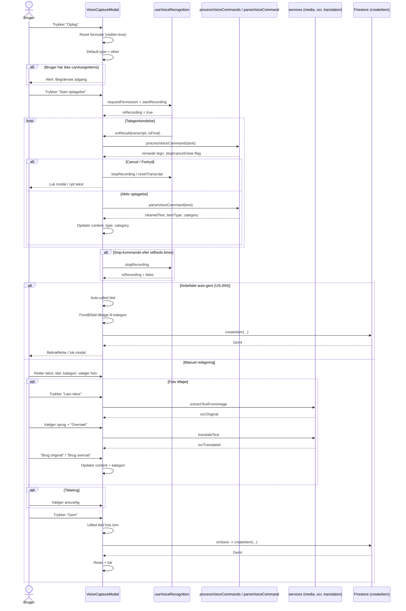
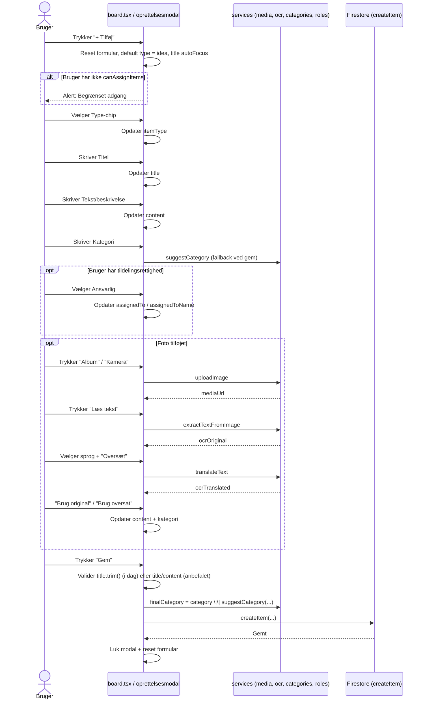

# US-004: Felt-for-felt flow-analyse af oprettelsesmodalen

**Dato:** 2026-07-15  
**Scope:** Analyse og anbefaling – ingen kodeændringer.  
**Fokus:** De to oprettelsesveje i Data Capture:

- **Optag:** `components/VoiceCaptureModal.tsx` + `hooks/useVoiceRecognition.ts`
- **+ Tilføj:** `app/(tabs)/board.tsx`

---

## 1. Nuværende tilstand (kort)

De to modalers deler mange felter, men adskiller sig på afgørende punkter:

| Forskel | Optag (VoiceCaptureModal) | + Tilføj (board.tsx) |
|---|---|---|
| **Type-default** | `other` | `idea` |
| **Type-chips** | 5 typer: `other`, `observation`, `bug`, `idea`, `note` | 7 typer: alle inkl. `photo`, `voice` |
| **Rækkefølge** | Type → Optageknap → Tekst → Titel → Kategori → Foto → OCR → Ansvarlig | Type → Titel → Tekst → Kategori → Ansvarlig → Foto → OCR |
| **Gem-krav** | Kræver `content.trim()` | Kræver `title.trim()` |
| **Auto-titel** | Ja: første 6 ord af tekst | Nej: titel er påkrævet |
| **Auto-gem** | Nej – optagelse stopper ved stilhed, men gemmer ikke automatisk | Nej |
| **OCR handlinger** | Kopiér + Del | Kun kopiér |
| **Annuller** | Kalder `onClose`; reset køres ved næste `visible` | Resetter og lukker manuelt |

---

## 2. Felt-for-felt analyse

### 1. Type-vælger

| Punkt | Beskrivelse |
|---|---|
| **Navn** | Type-vælger |
| **Formål** | Klassificerer sagens karakter / input-kanal. Bruges til farvekodet badge i board-listen, filtre og som udgangspunkt for kategori-forslag. |
| **Udfyldes af** | - Manuel tryk på chip. - Stemmekommando i starten af optagelse (`idé`, `bug`, `observation`, `notat`, …). - AI/heuristik ud fra tekstindhold. - Kan arves fra input-kanal (f.eks. foto → `photo`, stemme → `voice`). |
| **Påvirker** | Kategori (default/forslag), badge-farve i board, søgning/filtrering. |
| **Påvirkes af** | Tekst/beskrivelse (AI-forslag), stemmekommando, valgt foto (kan sætte `photo`), optagekanal (kan sætte `voice`). |
| **Synlighed** | Altid synlig i begge modalers. I dag viser Optag kun 5 chips, mens +Tilføj viser 7. |
| **Påkrævet / valgfrit** | Påkrævet, men har altid en default (`other` i Optag, `idea` i +Tilføj). |
| **Validering** | Skal være en gyldig `ItemType` (`idea`, `observation`, `bug`, `note`, `photo`, `voice`, `other`). `normalizeItemType()` falder tilbage på `other` ved ugyldig værdi. |
| **Bemærkning** | Der er en uoverensstemmelse mellem dansk UI (`"Bug"`) og stemmekommando/kategori (`"Fejl"`). Anbefaling: ensret label til enten `Fejl` eller `Bug`. Se afsnittet om Type/Kategori nedenfor. |

---

### 2. Tekst / beskrivelse

| Punkt | Beskrivelse |
|---|---|
| **Navn** | Tekst / beskrivelse (feltet hedder `content` i data-modellen) |
| **Formål** | Indeholder sagens egentlige indhold: noter, observation, transkription, OCR-resultat eller oversættelse. |
| **Udfyldes af** | - Tastatur i +Tilføj. - Stemmegenkendelse i Optag (live transcript). - OCR "Brug original"/"Brug oversat". - Manuelt redigeret efter optagelse. |
| **Påvirker** | Titel (auto-udledes hvis titel er tom), Kategori (suggestCategory), Gem-knap (Optag kræver content), Type-forslag (AI). |
| **Påvirkes af** | Stemmekommandoen `fortryd`/`ryd`/`clear` nulstiller feltet. OCR lægger tekst ind. Optagelse tilføjer løbende transcript. |
| **Synlighed** | Altid synlig. I Optag er det en stor tekstboks under optageknappen; i +Tilføj er det en tekstboks under titlen. |
| **Påkrævet / valgfrit** | I dag kræves det kun i Optag. Anbefaling: Mindst én af felterne **Titel** eller **Tekst** skal have indhold for at kunne gemme. |
| **Validering** | Trimming af mellemrum; ingen maksimallængde i dag. Tekst kopieres uændret til `content`. |
| **Bemærkning** | Tekstfeltet er det centrale "fangstfelt". I Optag bør det være det første indtastningsfelt efter Type, fordi brugeren primært vil se og rette transkriptionen. |

---

### 3. Titel

| Punkt | Beskrivelse |
|---|---|
| **Navn** | Titel |
| **Formål** | Kort beskrivende overskrift, der vises i board-kortet og i lister. Gør sager nemme at scanne. |
| **Udfyldes af** | - Manuelt tastatur. - Auto-udledt fra tekst i Optag (første 6 ord). - Kan efterfølgende redigeres. |
| **Påvirker** | Kategori-forslag (`suggestCategory` bruger `title \|\| content`), Gem-knap i +Tilføj (kræver title i dag), visning i board. |
| **Påvirkes af** | Tekst/beskrivelse (auto-titel hvis tom), OCR (indirekte via content). |
| **Synlighed** | Altid synlig i dag. Kan med fordel vises som valgfrit/ekspanderet felt, da mange sager kan genkendes på tekstens første linje. |
| **Påkrævet / valgfrit** | I dag påkrævet i +Tilføj, valgfri i Optag. Anbefaling: Valgfri så længe der er tekst; auto-udledes og gemmes. |
| **Validering** | Trimmet tekst; hvis tom og tekst findes, udledes titel automatisk før gem. |
| **Bemærkning** | +Tilføj gemmer ikke en auto-udledt titel i dag, hvorimod Optag altid gemmer en. Det bør ensrettes, så board-kort altid har en visningsbar titel. |

---

### 4. Kategori

| Punkt | Beskrivelse |
|---|---|
| **Navn** | Kategori |
| **Formål** | Emne-bucket til gruppering, filtre og dybe links (f.eks. board?category=Fejl). |
| **Udfyldes af** | - Manuelt tastatur. - AI/heuristik (`suggestCategory` fra `title + content + type`). - Stemmekommando-prefix (`bug` → `Fejl`, `idé` → `Idé`). - OCR (genkendt tekst foreslår kategori). |
| **Påvirker** | Board-filtrering, deep-link genveje, farvekodet kategori-chip i kortet. |
| **Påvirkes af** | Type (fallback hvis tekst ikke matcher heuristik), Tekst/beskrivelse, Titel, OCR-resultat. |
| **Synlighed** | Altid synlig i dag. Bør beholdes synlig, da den er central for organisering. |
| **Påkrævet / valgfrit** | Valgfri. Hvis tom, vælger `suggestCategory()` et fallback baseret på tekst eller Type ved gem. |
| **Validering** | Frit tekstfelt; første bogstav normaliseres til stort i stemmeparseren. Ingen entydighedskontrol i projektet i dag. |
| **Bemærkning** | Relationen til Type er svag: Type sætter kun et udgangspunkt. Se konkret anbefaling nedenfor. |

---

### 5. Foto

| Punkt | Beskrivelse |
|---|---|
| **Navn** | Foto (medie / `mediaUrl`) |
| **Formål** | Visuel dokumentation af sagen. Kan også være input til OCR/oversættelse. |
| **Udfyldes af** | - Knap "Album" eller "Kamera". - Upload til Cloud Storage under `projects/{id}/items/`. |
| **Påvirker** | OCR-oversættelse bliver tilgængelig; board-kort viser foto-badge; gemt som `mediaUrl`. |
| **Påvirkes af** | Ingen andre felter. Hvis brugeren vælger Type=`photo`, bør foto være tilstede, men der er ingen validering af dette i dag. |
| **Synlighed** | Altid synlig som to knapper, indtil et billede er valgt; derefter forhåndsvisning + "Fjern foto" + "Læs tekst". |
| **Påkrævet / valgfrit** | Valgfri. |
| **Validering** | Upload skal lykkes; ellers vises fejl. Der er ingen validering af, at Type=`photo` kræver et billede. |
| **Bemærkning** | I dag kan man i +Tilføj manuelt vælge Type=`photo` eller `voice`, selvom man hverken tager foto eller optager. Det skaber inkonsistens mellem Type og input-kanal. |

---

### 6. OCR-oversættelse

| Punkt | Beskrivelse |
|---|---|
| **Navn** | OCR-oversættelse |
| **Formål** | Læse tekst fra et vedhæftet foto og give mulighed for at oversætte og indsætte teksten i sagens indhold. |
| **Udfyldes af** | - Bruger trykker "Læs tekst" efter foto er valgt. - `extractTextFromImage()` returnerer original tekst. - Bruger vælger sprog og trykker "Oversæt". - "Brug original"/"Brug oversat" kopierer tekst til tekstfeltet. |
| **Påvirker** | Tekst/beskrivelse (tilføjer genkendt/oversat tekst), Kategori (genforslås ud fra tekst). |
| **Påvirkes af** | Foto (skal have `mediaUri`), sprogvalg, oversættelsestjeneste. |
| **Synlighed** | Kun synlig når `ocrOriginal` ikke er tom – dvs. efter bruger har trykket "Læs tekst" og der blev fundet tekst. |
| **Påkrævet / valgfrit** | Valgfri. |
| **Validering** | Hvis billedet ikke indeholder genkendelig tekst, vises `Alert.alert("Ingen tekst", …)`. Oversættelsesknappen er deaktiveret mens der oversættes. |
| **Bemærkning** | Optag har "Del"-knap på OCR, mens +Tilføj kun har "Kopiér". Det bør ensrettes. OCR-tekst tilføjes nederst i content med linjeskift; hvis brugeren vil erstatte, skal det være eksplicit. |

---

### 7. Ansvarlig

| Punkt | Beskrivelse |
|---|---|
| **Navn** | Ansvarlig |
| **Formål** | Tildel sagen til en projektdeltager (eller sig selv) for opfølgning. |
| **Udfyldes af** | Bruger trykker på et chip blandt projektets medlemmer. |
| **Påvirker** | `assignedTo` og `assignedToName` gemmes; vises i board-kort. |
| **Påvirkes af** | Projektmedlemsliste (subscribes), brugerens rolle (`canAssignItems`/`canAssignOthers`). |
| **Synlighed** | Kun synlig hvis `canAssignItems(projectRole)` er sand og der findes mere end én tildelingsmulighed. Andre medlemmer end bruger selv vises kun for `owner`/`admin`. |
| **Påkrævet / valgfrit** | Valgfri; default `"Ingen ansvarlig"`. |
| **Validering** | Kun bruger-id'er fra projektets medlemsliste kan vælges. |
| **Bemærkning** | I board.tsx skjules "Ingen ansvarlig"-chippen under visse kombinationer (`assigneeChipHidden`), hvilket er forvirrende. Anbefaling: vis altid "Ingen ansvarlig" som et eksplicit valg. |

---

### 8. Gem / Annuller

| Punkt | Beskrivelse |
|---|---|
| **Navn** | Gem / Annuller |
| **Formål** | Gem sagen i Firestore eller kassér indtastningen. |
| **Udfyldes af** | Bruger trykker på knap. |
| **Påvirker** | Opretter `items`-dokument, lukker modalen, nulstiller formularen, opdaterer board-listen. |
| **Påvirkes af** | Alle felter, rolle (`canAssignItems`), netværk/Firestore, minimumsvalidering (title/content). |
| **Synlighed** | Altid synlig nederst i modalen. |
| **Påkrævet / valgfrit** | n/a. |
| **Validering** | - Aktivt projekt og bruger skal findes. - Bruger skal have `canAssignItems`. - I Optag kræves `content.trim()`. - I +Tilføj kræves `title.trim()`. - Anbefalet fremtid: kræv `title.trim() \|\| content.trim()`. |
| **Bemærkning** | Fejlhåndtering viser `Alert.alert("Fejl", "Kunne ikke …")` og lukker ikke modalen. Der er dog forskel på, hvordan de to modalers nulstiller sig efter annullering; det bør ensrettes. |

---

## 3. Sekvensdiagram / flow: Oprettelse via Optag

**Bemærkning til flow:** I den nuværende kode stopper stilheds-timeren kun optagelsen (`ExpoSpeechRecognitionModule.stop()`), men gemmer ikke automatisk. US-004 ønsker, at stilhed efter X sekunder også udløser gem (auto-gem). Diagrammet viser begge veje.

---

## 4. Sekvensdiagram / flow: Oprettelse via + Tilføj

---

## 5. Anbefaling af feltrækkefølge

Mål: **én fælles, ensartet rækkefølge** i begge modalers, så brugeren ikke skal genlære UI'en.

| # | Felt | Begrundelse |
|---|---|---|
| 1 | **Type-vælger** | Sætter kontekst og farve. Påvirker kategori-forslag. Bør vises øverst, men kan være forudfyldt/AI-forslået. |
| 2 | **Tekst / beskrivelse** | Det primære fangstfelt – især ved stemme. Brugeren skal se transkriptionen/meddelelsen først. |
| 3 | **Titel** | Valgfri, auto-udledt fra tekst. Kan vises som kompakt forslag, der kan trykkes for at redigere. |
| 4 | **Kategori** | Smart tag / autocomplete. Forslås ud fra Type + tekst; brugeren kan overskrive eller fjerne. |
| 5 | **Foto** | Album/kamera + forhåndsvisning. Placeres efter tekst, så det ikke dominerer simple noter. |
| 6 | **OCR-oversættelse** | Kun synlig når foto indeholder tekst. Vises umiddelbart under foto. |
| 7 | **Ansvarlig** | Avanceret felt; kun synlig ved rettigheder og medlemmer. |
| 8 | **Gem / Annuller** | Altid nederst; ens placering skaber forudsigelighed. |

### Særligt for Optag
- Over Type kan der vises en optagekontrol med start/stop, timer og auto-gem-toggle.
- Hjælpetekst om stemmekommandoer placeres lige under optageknappen.
- Tekstfeltet skal have fokus/fremhævning under og lige efter optagelse.

### Særligt for + Tilføj
- Ingen optagekontrol, ingen auto-gem-hjælpetekst.
- Titel-feltet kan starte sammenfoldet som "Rediger titel (valgfrit)", men skal altid kunne åbnes.

---

## 6. Konkret anbefaling: Type og Kategori

### Princip

- **Type** = sagens karakter / input-kanal. Fast, farvekodet enum. Det er ikke frit tekst.
- **Kategori** = emne / bucket. Frit tekst med autocomplete/historik og AI-forslag.
- **Sammenhæng:** Type angiver et **default-udgangspunkt** for Kategori, men de er ikke 1:1.

### Forslag til mapping (fallback)

| Type | Foreslået default-kategori | Bemærkning |
|---|---|---|
| `idea` | `Idé` | Hvis teksten ikke peger på et mere specifikt emne. |
| `observation` | `Observation` | Kan også falde tilbage på `Test`, hvis teksten peger på kvalitet. |
| `bug` | `Fejl` | Overvej at ensrette dansk label: Type=`Fejl` i stedet for `Bug`. |
| `note` | `Notat` | Generelle bemærkninger. |
| `photo` | `Foto` | Kun hvis Type sættes automatisk fra foto. |
| `voice` | `Stemme` | Kun hvis Type sættes automatisk fra optagelse. |
| `other` | `Andet` | Fanger resten. |

### Regler for interaktion

1. **Ved oprettelse:** Hvis brugeren ikke angiver Kategori, bruges `suggestCategory(title, content, type)`.
2. **Ved Type-ændring:** Hvis Kategori-feltet er tomt eller stadig er den gamle Type-default, opdateres forslaget. Hvis brugeren har skrevet noget selv, respekteres det.
3. **Ved tekstændring:** Kategori kan genforslås (ikke-tvingende), hvis feltet er tomt.
4. **Ved stemmekommando:** Prefix som `bug` sætter både Type=`bug` og Kategori=`Fejl`, men brugeren kan overskrive.
5. **Foto/Stemme som Type:**
   - I **+ Tilføj** bør `photo` og `voice` **ikke** vælges manuelt. De sættes automatisk, når brugeren tilføjer foto eller bruger optagelse.
   - I **Optag** kan Type-chip `voice` være synlig som indikator, men den bør sættes automatisk.

### Åbent valg til PO

Skal dansk UI-label for Type `bug` være `Bug` eller `Fejl`? Konsekvenser:
- `Bug`: Udviklere genkender termen; men stemmekommandoen "fejl" og kategorien "Fejl" kan forvirre.
- `Fejl`: Ensretter dansk UI med stemmekommando og kategori; men fjerner sig fra standard udviklingsterminologi.

Anbefaling: Skift label til **"Fejl"** for at undgå to forskellige ord for samme koncept i den danske app. Hvis PO ønsker at beholde "Bug", bør kategorien omdøbes eller Type-label forklares tydeligt.

---

## 7. Yderligere bemærkninger og risici

1. **Auto-gem er ikke implementeret i dag.** `useVoiceRecognition` stopper optagelsen efter 3 sekunders stilhed, men modalen gemmer ikke. US-004 kræver en klar beslutning om timeout-længde og default til/fra.
2. **Foto-only eller stemme-only sager kan ikke gemmes.** Optag kræver `content`; +Tilføj kræver `title`. Med den anbefalede validering (`title || content`) løses dette.
3. **Reset-adfærd adskiller sig.** VoiceCaptureModal nulstiller ved `visible`-skift; board.tsx gør det ved "Annuller" og efter gem. Anbefaling: brug en fælles `resetForm()`-funktion.
4. **OCR-deleknappen findes kun i Optag.** Begge veje bør have samme kopier/del-funktioner.
5. **Der er ingen deduplikerings- eller titel-unikhedskontrol for sager.** Hvis PO ønsker at undgå identiske sager, skal det specificeres separat.
6. **Kategori er frit tekst i dag.** Hvis projektet vokser, bør overvejes en projekt-specifik kategoriliste + autocomplete for at undgå stavevarianter ("Fejl" vs "fejl").

---

## 8. Åbne spørgsmål til PO

Følgende spørgsmål bør besvares, før der skrives ny kode:

1. **Titel vs. tekst:** Skal modalen have ét primært tekstfelt med auto-udledt titel, eller beholdes to adskilte felter?
2. **Type-UI:** Skal Type altid vises som manuelle chips, eller må AI skjule/forhåndsudvælge den, når den er sikker?
3. **Kategori-input:** Frit tekst, dropdown over eksisterende kategorier, eller smart autocomplete med AI-forslag?
4. **Type/Kategori:** Er du enig i, at Type er sagens karakter og Kategori er emne/bucket, og at Type kun sætter et kategori-udgangspunkt?
5. **Type-label:** Skal Type `bug` vises som "Bug" eller "Fejl" på dansk?
6. **Foto/Stemme som Type i +Tilføj:** Skal `photo` og `voice` være valgbare manuelt, eller kun sættes automatisk ud fra input-kanalen?
7. **Validering:** Skal der kræves titel, indhold, eller er det nok med én af dem?
8. **Ansvarlig default:** "Ingen ansvarlig" eller "Mig"?
9. **Auto-gem timeout:** Hvor mange sekunders stilhed skal udløse auto-gem, og skal det være slået til eller fra som standard?
10. **Efter auto-gem:** Skal modalen lukke eller forblive åben til flere sager i træk?
11. **OS-timeout:** Hvis platformen selv stopper optagelsen, skal appen informere, genoptage automatisk eller tilbyde at fortsætte i ny optagelse?
12. **OCR-del:** Skal både Optag og +Tilføj have "Del"-knap på OCR-tekst?
13. **Projektkategorier:** Ønsker du en projekt-specifik liste over kategorier med autocomplete, eller skal kategori forblive frit tekst?

---

*Dokumentet er udarbejdet af Creative/AI Challenger Agent i samarbejde med Userstoryagent. Godkendelse af scope og besvarelse af spørgsmål til PO kræves før implementering.*
